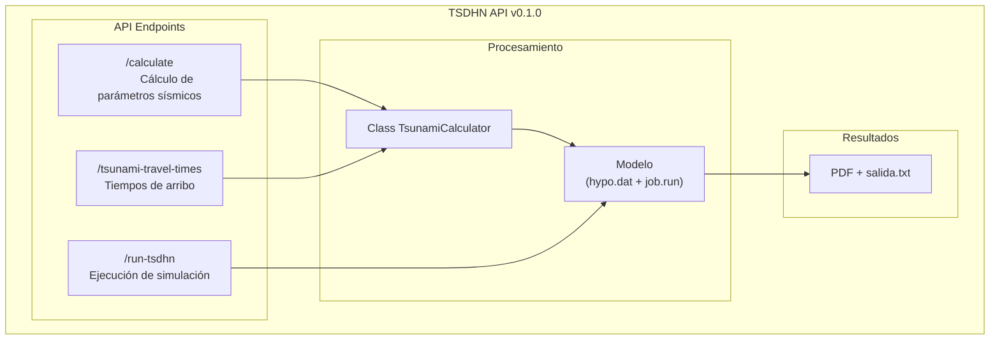

# TSDHN API

El modelo TSDHN permite la estimación de parámetros de tsunamis de origen lejano mediante simulaciones numéricas. Este repositorio contiene la API TSDHN, una interfaz desarrollada con FastAPI que facilita la comunicación entre [picv-2025-web](https://github.com/totallynotdavid/picv-2025-web) y el [modelo TSDHN](https://github.com/totallynotdavid/picv-2025/tree/main/model).

El siguiente diagrama describe el flujo de trabajo de la API TSDHN:



## Instalación

> [!WARNING]
> Esta API funciona solo en sistemas operativos Linux debido a su dependencia de scripts C shell. No es compatible con Windows de forma nativa. Se recomienda usar Windows Subsystem for Linux (WSL) para usuarios de Windows. [Instalación de WSL](https://learn.microsoft.com/es-es/windows/wsl/install)

**Pre-requisitos:** Ubuntu 20.04, Python 3.10, MATLAB R2014, gfortran, csh, poetry.

Para instalar la API TSDHN:

```bash
git clone https://github.com/totallynotdavid/picv-2025
cd picv-2025
poetry install
eval $(poetry env activate)
```

**Consejo**: Verifica la instalación ejecutando las pruebas: `poetry run pytest`.

## Parámetros de entrada

El modelo requiere los siguientes **parámetros de entrada** para la simulación:

| Parámetro           | Descripción                         | Unidad            |
| ------------------- | ----------------------------------- | ----------------- |
| Hora de origen      | Momento exacto del terremoto        | Timestamp         |
| Longitud            | Coordenada geográfica del epicentro | Grados            |
| Latitud             | Coordenada geográfica del epicentro | Grados            |
| Profundidad focal   | Profundidad del hipocentro          | Kilómetros        |
| Magnitud de momento | Escala de intensidad sísmica        | Mw (adimensional) |

## Endpoints

La API expone los siguientes endpoints:

1. [`/calculate`](orchestrator/main.py?plain=1#L25): Calcula los parámetros sísmicos del terremoto.
2. [`/tsunami-travel-times`](orchestrator/main.py?plain=1#L43): Calcula los tiempos de arribo del tsunami a las costas peruanas, basándose en el archivo [`puertos.txt`](model/puertos.txt).
3. [`/run-tsdhn`](orchestrator/main.py?plain=1#L59): Ejecuta la simulación numérica del modelo TSDHN.
4. [`/health`](orchestrator/main.py?plain=1#L88): Endpoint para verificar el estado de la API.

> [!WARNING]
> Los primeros tres endpoints deben ejecutarse en ese orden ya que cada uno depende del anterior.

### `/calculate`

Este endpoint recibe los parámetros del terremoto y calcula parámetros sísmicos adicionales.

Ejemplo de solicitud (POST):

```json
POST /calculate
{
    "Mw": 7.5,
    "h": 10.0,
    "lat0": -20.5,
    "lon0": -70.5,
    "dia": "15",
    "hhmm": "1430"
}
```

La respuesta incluirá parámetros como la longitud y ancho de ruptura, desplazamiento, momento sísmico y una evaluación del riesgo de tsunami:

```json
{
  "length": 120.5,
  "width": 80.3,
  "dislocation": 2.5,
  "seismic_moment": 3.2e20,
  "tsunami_warning": "Alerta de tsunami para costas cercanas",
  "distance_to_coast": 45.2,
  "azimuth": 18.5,
  "dip": 30.0,
  "epicenter_location": "mar"
}
```

### `/tsunami-travel-times`

Este endpoint utiliza los mismos parámetros que `/calculate` y calcula los tiempos de llegada del tsunami a las diferentes estaciones definidas en [`puertos.txt`](model/puertos.txt). Devuelve un objeto JSON con los tiempos de arribo y distancias para cada estación.

### `/run-tsdhn`

Este endpoint ejecuta el script csh [`job.run`](model/job.run) que realiza la simulación del tsunami. La ejecución puede tardar aproximadamente 12 minutos en un procesador i9.

> [!IMPORTANT]
> El modelo solo procesa magnitudes entre Mw 6.5 y Mw 9.5. Valores fuera de este rango resultarán en un error.

Salida:

1. Un [reporte.pdf](model/reporte.pdf) que contiene un mapa de tiempos de arribo y mareogramas sintéticos para cada estación en [`puertos.txt`](model/puertos.txt).
2. Un archivo de texto llamado [`salida.txt`](model/salida.txt) con datos del epicentro y tiempos de arribo.

## Problemas comunes

1. Si `job.run` no se ejecuta correctamente, verifica que el archivo tenga permisos de ejecución con `chmod +x model/job.run`.
2. Comprueba que el archivo `hypo.dat` se haya generado correctamente en el directorio `model/` antes de usar el endpoint `/run-tsdhn`. Si no existe, ejecuta los endpoints `/calculate` y `/tsunami-travel-times` antes de ejecutar `/run-tsdhn`.
