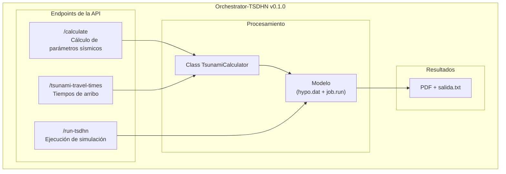

# Orchestrator-TSDHN

El Orchestrator-TSDHN es una herramienta para la estimación de parámetros de tsunamis de origen lejano mediante simulaciones numéricas. Combina el **modelo TSDHN escrito en Fortran** (en la carpeta [`/model`](/model/)) con una **API escrita en Python** (en la carpeta [`/orchestrator`](/orchestrator/)) que procesa datos sísmicos iniciales, como ubicación y magnitud de terremotos, para calcular variables como: dimensiones de ruptura sísmica, momento sísmico y desplazamiento de la corteza. Estas variables son utilizadas finalmente en la simulación principal, cuyo resultado incluye un informe en formato PDF con mapas de propagación, gráficos de mareógrafos y datos técnicos, además de un archivo de texto con tiempos de arribo a estaciones costeras.

> [!IMPORTANT]
> La lógica de los cálculos numéricos reside en este repositorio, mientras que la [interfaz web](https://github.com/totallynotdavid/picv-2025-web) (que gestiona solicitudes y entrega el informe al usuario final) opera en un entorno separado.

A continuación, se muestra un diagrama que ilustra el flujo general del Orchestrator-TSDHN:



## Instalación

> [!WARNING]
> El proyecto requiere **Ubuntu 20.04** o superior. Usuarios de Windows deben configurar Windows Subsystem for Linux (WSL 2.0 o superior) siguiendo la [<kbd>guía oficial</kbd>](https://learn.microsoft.com/es-es/windows/wsl/install) de Microsoft antes de continuar.

**Prerrequisitos:**

Actualice los paquetes del sistema antes de iniciar:

```bash
sudo apt update -y && sudo apt upgrade -y
```

1. **Python** (con [pyenv](https://github.com/pyenv/pyenv)): Usamos pyenv porque nos permite gestionar múltiples versiones de Python. Ejecute:

   ```bash
   curl -fsSL https://pyenv.run | bash
   ```

   <ins>Si estás usando WSL</ins>, ejecuta lo siguiente [[1](https://stackoverflow.com/a/76483889)]:

   ```bash
   cat << 'EOF' >> ~/.bashrc
   export PYENV_ROOT="$HOME/.pyenv"
   export PATH="$PYENV_ROOT/bin:$PATH"
   eval "$(pyenv init -)"
   EOF
   ```

   <ins>Si estás usando Ubuntu de forma nativa</ins>, ejecuta lo siguiente [[2](https://github.com/pyenv/pyenv?tab=readme-ov-file#bash)]:

   ```bash
   cat << 'EOF' >> ~/.bashrc
   export PYENV_ROOT="$HOME/.pyenv"
   [[ -d $PYENV_ROOT/bin ]] && export PATH="$PYENV_ROOT/bin:$PATH"
   eval "$(pyenv init - bash)"
   EOF
   ```

   En cualquiera de los dos casos, aplica los cambios con:

   ```bash
   source ~/.bashrc
   ```

   pyenv compila Python a partir del código fuente durante la instalación, por lo que resulta necesario instalar previamente las dependencias de compilación [[3](https://stackoverflow.com/a/74314165)] [[4](https://github.com/pyenv/pyenv/wiki#suggested-build-environment)] y, luego, instala Python:

   ```bash
   sudo apt install -y build-essential zlib1g-dev libffi-dev libssl-dev libbz2-dev libreadline-dev libsqlite3-dev liblzma-dev libncurses-dev tk-dev
   pyenv install 3.12 && pyenv global 3.12
   ```

   Si deseas usar Python del sistema en lugar de `pyenv`, solo necesitas instalar `pip3`:

   ```bash
   sudo apt install -y python3-pip
   ```

   En cualquiera de los dos casos, verifica la instalación:

   ```bash
   python3 -V
   pip3 -V
   ```

2. [**Poetry**](https://python-poetry.org/docs) nos ayuda a gestionar nuestras dependencias de forma consistente entre dispositivos. Poetry se encarga de instalar las librerías que usamos.

   ```bash
   curl -sSL https://install.python-poetry.org | python3 -
   echo 'export PATH="$HOME/.local/bin:$PATH"' >> ~/.bashrc
   source ~/.bashrc
   ```

   Verifica la instalación:

   ```bash
   poetry --version
   ```

3. [**TTT SDK**](https://www.geoware-online.com/tsunami.html) (Tsunami Travel Time) calcula los tiempos de arribo de un tsunami a partir de la batimetría de una cuadrícula geográfica (el océano Pacífico en nuestro caso). Para instalarlo, necesitas `git-lfs` para clonar los archivos de datos grandes del repositorio y `cmake` para compilar e instalar el software:

   ```bash
   sudo apt install -y git-lfs cmake
   ```

   Para instalar el TTT SDK:

   ```bash
   git clone https://gitlab.com/totallynotdavid/tttapi/
   cd tttapi && make config compile && sudo make install datadir docs
   make test clean
   ```

> [!NOTE]
> El SDK usa GitLab para aprovechar su política de LFS gratuito y para reducir la carga en los servidores de los autores durante pruebas CI/CD.

4. [**TeXLive**](https://www.tug.org/texlive/quickinstall.html) es utilizado para la generación de los informes. Para simplificar el proceso, se opta por una instalación mínima. Ejecute:

   ```bash
   cd /tmp
   wget https://mirror.ctan.org/systems/texlive/tlnet/install-tl-unx.tar.gz
   zcat < install-tl-unx.tar.gz | tar xf -
   cd install-tl-2*
   ```

   Crea un perfil de instalación (<kbd>texlive.profile</kbd>) con el siguiente contenido:

   ```bash
   cat > texlive.profile << EOF
   selected_scheme scheme-basic
   tlpdbopt_autobackup 0
   tlpdbopt_install_docfiles 0
   tlpdbopt_install_srcfiles 0
   EOF
   ```

   La instalación se realiza en el directorio del usuario para evitar problemas relacionados a permisos y evitar el [modo usuario](https://www.tug.org/texlive/doc/tlmgr.html#USER-MODE) de TeXLive [[5](https://tex.stackexchange.com/a/676880)]:

   ```bash
   perl ./install-tl --profile=texlive.profile \
                     --texdir "$HOME/texlive" \
                     --texuserdir "$HOME/.texlive" \
                     --no-interaction
   ```

   Configuración del <kbd>PATH</kbd>:

   ```bash
   echo -e '\nexport PATH="$HOME/texlive/bin/x86_64-linux:$PATH"' >> ~/.bashrc
   source ~/.bashrc
   ```

   Instalación de paquetes LaTeX necesarios:

   ```bash
   tlmgr update --self && tlmgr install babel-spanish hyphen-spanish booktabs
   ```

5. Dependencias adicionales: `gfortran`, `redis-server`, `gmt`, `ps2eps`, `csh`. Ejecute:

   ```bash
   sudo apt install -y gfortran redis-server gmt gmt-dcw gmt-gshhg ps2eps csh
   ```

   Configura Redis para ser gestionado por systemd:

   ```bash
   sudo sed -i 's/^# \?supervised \(no\|auto\)/supervised systemd/' /etc/redis/redis.conf
   sudo systemctl restart redis-server
   ```

6. Si necesitas ejecutar la interfaz gráfica original ([<kbd>tsunami.m</kbd>](model/tsunami.m)), puedes instalar [MATLAB R2014](https://drive.google.com/file/d/1VhLnwXX78Y7O8huwlRuE-shOW2LKlVpd/view?usp=drive_link).

**Pasos de instalación:**

1. Clona el repositorio e instala las dependencias:

   ```bash
   git clone https://github.com/totallynotdavid/picv-2025
   cd picv-2025 && poetry install
   poetry self add 'poethepoet[poetry_plugin]'
   ```

2. Valide la instalación con:

   ```bash
   poetry run pytest # Todos los tests deben pasar
   ```

3. Para iniciar la API:

   ```bash
   poetry run start
   ```

   La API estará disponible en `http://localhost:8000`.

   En un terminal diferente, ejecuta el siguiente comando para iniciar el RQ worker:

   ```bash
   poetry run rq worker tsdhn_queue
   ```

> [!TIP]
> Si deseas probar el modelo con condiciones específicas, consulta la sección de [pruebas personalizadas](#pruebas-personalizadas).

## Estructura del proyecto

El repositorio se organiza en dos componentes principales:

```txt
picv-2025/
├── orchestrator/
│   ├── core/
│   │   ├── calculator.py         # Class TsunamiCalculator y la lógica central de los cálculos.
│   │   └── config.py             # Define constantes globales y la configuración del logging.
│   ├── main.py                   # Punto de entrada de la API y definición de los endpoints.
│   ├── models/
│   │   └── schemas.py            # Schema para la validación y transformación de los datos.
│   └── utils/
│       └── geo.py                # Funciones para cálculos geográficos (distancias, formatos, etc.).
└── model/
    ├── pacifico.mat              # Datos de batimetría del océano Pacífico.
    ├── maper1.mat                # Datos de puntos costeros.
    ├── mecfoc.dat                # Base de datos de mecanismos focales históricos.
    ├── puertos.txt               # Lista de puertos utilizados en el cálculo de tiempos de arribo.
    ├── job.run                   # Script C Shell para ejecutar la simulación.
    ├── reporte.pdf               # Reporte generado con el mapa de tiempos y mareogramas.
    └── salida.txt                # Archivo de salida con datos del epicentro y tiempos de arribo.
```

## Endpoints de la API

> [!WARNING]
> El modelo solo procesa magnitudes entre **Mw 6.5 y Mw 9.5**. Valores fuera de este rango resultarán en un error. Los siguientes endpoints deben invocarse en **orden secuencial estricto**:  
> `/calculate` → `/tsunami-travel-times` → `/run-tsdhn`.

El proceso inicia cuando el usuario envía datos sísmicos desde la [interfaz web](https://github.com/totallynotdavid/picv-2025-web).

1. [`POST /calculate`](orchestrator/main.py?plain=1#L27) recibe los valores para la magnitud (Mw), profundidad (h) y coordenadas del epicentro. Luego, calcula la geometría de la ruptura, el momento sísmico y evalúa el riesgo de tsunami. Genera el archivo [`hypo.dat`](model/hypo.dat) requerido en pasos posteriores.

   Los siguientes campos deben enviarse en el cuerpo de la solicitud en formato JSON:

   | Parámetro | Descripción                | Unidad              |
   | --------- | -------------------------- | ------------------- |
   | `Mw`      | Magnitud momento sísmico   | adimensional        |
   | `h`       | Profundidad del hipocentro | km                  |
   | `lat0`    | Latitud del epicentro      | grados              |
   | `lon0`    | Longitud del epicentro     | grados              |
   | `dia`     | Día del mes del evento     | string (ej. `"15"`) |
   | `hhmm`    | Hora y minutos del evento  | formato `HHMM`      |

   Ten en cuenta que los modelos Pydantic (definidos en [`schemas.py`](orchestrator/models/schemas.py)) se encargan de validar y, en algunos casos, transformar estos parámetros para asegurar que el formato sea el correcto.
   <details>
   <summary>Ejemplo de solicitud</summary>

   ```json
   {
     "Mw": 7.5,
     "h": 10.0,
     "lat0": -20.5,
     "lon0": -70.5,
     "dia": "15",
     "hhmm": "1430"
   }
   ```

   </details>

   <details>
   <summary>Ejemplo de respuesta esperada</summary>

   ```json
   {
     "length": 575.44,
     "width": 144.54,
     "dislocation": 10.64,
     "seismic_moment": 3.98e22,
     "tsunami_warning": "Genera un Tsunami grande y destructivo",
     "distance_to_coast": 10439.47,
     "azimuth": 247.0,
     "dip": 18.0,
     "epicenter_location": "mar",
     "rectangle_parameters": {
       "L1": 575439.94,
       "W1": 137469.49,
       "beta": 13.44,
       "alfa": -23.0,
       "h1": 591632.47,
       "a1": -49.15,
       "b1": 291.7,
       "xo": -153.35,
       "yo": 56.45
     },
     "rectangle_corners": [
       { "lon": -153.35, "lat": 56.45 },
       { "lon": -158.11, "lat": 54.42 },
       { "lon": -158.6, "lat": 55.56 },
       { "lon": -153.83, "lat": 57.58 },
       { "lon": -153.35, "lat": 56.45 }
     ]
   }
   ```

   </details>

2. [`POST /tsunami-travel-times`](orchestrator/main.py?plain=1#L45) utiliza los mismos datos de entrada que `/calculate` y realiza una serie de integraciones vectorizadas para calcular los tiempos de arribo a puertos predefinidos en [`puertos.txt`](/model/puertos.txt). La respuesta es un objeto JSON que incluye tanto los tiempos de arribo como las distancias a cada estación.

   <details>
   <summary>Ejemplo de respuesta esperada</summary>

   ```json
   {
     "arrival_times": {
       "-80.5876  -03.": "12:09 23Feb",
       "-81.2827  -04.": "12:12 23Feb",
       "__comment": "Otros puertos omitidos por brevedad",
       "-70.3232  -18.": "14:40 23Feb"
     },

     "distances": {
       "-80.5876  -03.": 9445.79,
       "-81.2827  -04.": 9491.94,
       "__comment": "Otros puertos omitidos por brevedad",
       "-70.3232  -18.": 11438.3
     },

     "epicenter_info": {
       "date": "23",
       "time": "0000",
       "latitude": "56.00",
       "longitude": "-156.00",
       "depth": "12",
       "magnitude": "9.0"
     }
   }
   ```

   </details>

3. [`POST /run-tsdhn`](orchestrator/main.py?plain=1#L61) inicia el proceso TSDHN. Anteriormente llamaba al script [`job.run`](model/job.run). Inicialmente procesa [`hypo.dat`](model/hypo.dat). El tiempo de ejecución varía entre 25-50 minutos dependiendo de la carga del sistema.

   <details>
   <summary>Ejemplo de respuesta esperada</summary>

   ```json
   {
     "status": "queued",
     "job_id": "dee661ec-1c39-47e5-bb50-3926fa70bb8e",
     "message": "TSDHN job has been queued successfully"
   }
   ```

   </details>

   donde:

   - `status` indica el estado de la simulación. Puede ser `queued`, `running`, `completed` o `failed`.
   - `job_id` es el identificador único de la simulación.
   - `message` proporciona información adicional sobre el estado de la simulación.

   Internamente, el endpoint produce:

   - Ejemplo de [`salida.txt`](model/salida.txt): Tiempos de arribo brutos.
   - Ejemplo de [`reporte.pdf`](model/reporte.pdf): Mapas de altura de olas, mareógrafos y parámetros técnicos.

4. [`GET /job-status/{job_id}`](orchestrator/main.py?plain=1#L134) retorna el estado actual de una simulación en la cola del RQ worker. Se espera un objeto JSON con el identificador de la simulación:

   <details>
   <summary>Ejemplo de solicitud</summary>

   ```json
   {
     "job_id": "dee661ec-1c39-47e5-bb50-3926fa70bb8e"
   }
   ```

   </details>

   <details>
   <summary>Ejemplo de respuesta esperada</summary>

   ```json
   {
     "status": "completed",
     "details": "Generating final report",
     "error": null,
     "created_at": "2025-02-17T19:46:08.171522",
     "started_at": "2025-02-17T19:46:08.345851",
     "ended_at": "2025-02-17T20:27:44.304036",
     "report_path": "/jobs/dee661ec-1c39-47e5-bb50-3926fa70bb8e/reporte.pdf"
   }
   ```

   </details>

5. [`GET /job-result/{job_id}`](orchestrator/main.py?plain=1#L163) retorna el informe generado. Ejemplo de uso:  
   `http://localhost:8000/job-result/dee661ec-1c39-47e5-bb50-3926fa70bb8e`

6. [`GET /health`](orchestrator/main.py?plain=1#L204) verifica la disponibilidad de la API.

   <details>
   <summary>Ejemplo de respuesta esperada</summary>

   ```json
   {
     "status": "healthy",
     "timestamp": "2025-02-17T16:22:45.133492",
     "calculator": "initialized",
     "queue": "connected"
   }
   ```

   </details>

## Pruebas personalizadas

Además de las [pruebas unitarias](orchestrator/tests/), hemos incluido un cliente de prueba ([`example.py`](example.py)) que permite evaluar el comportamiento del modelo en condiciones específicas.

Antes de ejecutar el cliente, asegúrate de que **la API esté activa** en segundo plano. Verifica su disponibilidad con:

```bash
curl -fsS http://localhost:8000/health
```

Si deseas configurar los parámetros de la simulación, edita los valores en <kbd>earthquake_data</kbd> en [example.py](example.py?plain=1#L65). Luego, ejecuta:

```bash
poetry run python example.py --test
```

Este comando prueba secuencialmente los endpoints `/calculate`, `/tsunami-travel-times` y `/run-tsdhn`. Una vez completada la inicialización, el cliente consulta al usuario si desea monitorear el progreso de la simulación. Para esto, se utilizan los endpoints `/job-status` y `/job-result`.

La primera vez que ejecutes el cliente, se crearán automáticamente dos archivos:

1. `configuracion_simulación.json`: Guarda los parámetros de la simulación para futuras referencias.
2. `last_job_id.txt`: Guarda el identificador de la simulación para monitorear su progreso.

Para monitorear el estado de una simulación específica, ejecuta:

```bash
poetry run python example.py --monitor <id-simulación> --intervalo 300
```

El identificador de la simulación se puede encontrar en `last_job_id.txt` o revisando los logs del RQ worker. Este comando verificará el progreso de la simulación pedida cada 300 segundos (5 minutos).

Si deseas reanudar la última simulación registrada, ejecuta:

```
poetry run python example.py --monitor last --timeout 7200
```

Este comando monitorea la última simulación registrada por un máximo de 7200 segundos (2 horas).

Los parámetros disponibles para la monitorización:

- `--monitor`: Especifica el identificador de la simulación a monitorizar. Use "last" para la simulación más reciente.
- `--interval`: Define el intervalo de verificación en segundos (predeterminado: 60).
- `--timeout`: Establece el tiempo máximo de monitorización en segundos (opcional).
- `--no-guardar`: Evita que se descargue y guarde automáticamente el informe de resultados.
- `--url`: Especifica una URL base alternativa para la API (predeterminado: http://localhost:8000). Útil para pruebas en entornos remotos.

También puedes ver los parámetros disponibles en el terminal con:

```bash
poetry run python example.py --help
```

> [!TIP]
> La monitorización puede interrumpirse en cualquier momento presionando <kbd>Ctrl+C</kbd>, sin afectar la simulación en curso.

## Notas adicionales

- La API guarda automáticamente algunos eventos en `tsunami_api.log`. Puedes configurar el logger en [`config.py`](/orchestrator/core/config.py) si deseas. El archivo de logs se crea cuando inicias la API.
- Si estás haciendo pruebas y quieres ver los logs en tu terminal mientras usas `pytest`, solo necesitas cambiar una línea en [`pyproject.toml`](pyproject.toml):

  ```toml
  [tool.pytest.ini_options]
  log_cli = true
  ```

  Es recomendable usar `logger.debug()` en vez de `print()` o sino pytest lo ignorará.

- Cuando termines de hacer cambios en el código, y antes de hacer commit, ejecuta:

  ```bash
  poetry run pytest
  poetry poe format
  ```

  para formatear el código y asegurarte de todo sigue funcionando correctamente.
