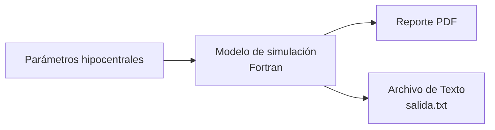

# TSDHN

El modelo TSDHN permite la estimación de parámetros de tsunamis de origen lejano mediante simulaciones numéricas.

El flujo de trabajo del modelo se describe a continuación:

El modelo requiere de los siguientes **parámetros de entrada** para la simulación:

| Parámetro           | Descripción                  | Unidad            |
| ------------------- | ---------------------------- | ----------------- |
| Hora de origen      | Momento exacto del terremoto | Timestamp         |
| Longitud            | Coordenada geográfica        | Grados            |
| Latitud             | Coordenada geográfica        | Grados            |
| Profundidad focal   | Profundidad del terremoto    | Kilómetros        |
| Magnitud de momento | Escala de intensidad sísmica | Mw (adimensional) |

La simulación se realiza mediante un script C shell llamado `job.run`, que ejecuta el modelo Pre-Tsunami en Fortran y genera un reporte PDF con los resultados de la simulación.

La simulación tarda aproximadamente 12 minutos en un procesador Intel i9, generando resultados detallados en dos formatos principales:

1. Un reporte en formato PDF que contiene información del terremoto, incluyendo un mapa de tiempo de arribo del tsunami y mareogramas virtuales para las estaciones de Talara, Callao y Matarani.

2. Un archivo de texto llamado `salida.txt` que proporciona datos numéricos detallados de la simulación.

> [!TIP]
> Para usuarios de Windows, se recomienda utilizar FileZilla para la transferencia de archivos mediante conexión SFTP. La conexión se realiza al servidor con la dirección `sftp://Geo01@192.168.3.31`.
