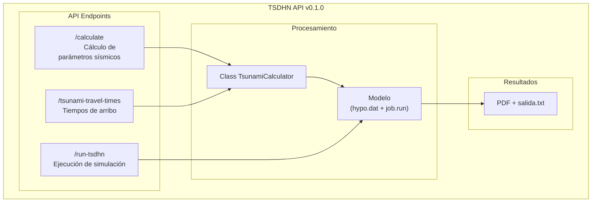

# TSDHN API

El modelo TSDHN permite la estimación de parámetros de tsunamis de origen lejano mediante simulaciones numéricas. Este repositorio contiene la TSDHN API, una interfaz desarrollada con FastAPI que facilita la comunicación entre [picv-2025-web](https://github.com/totallynotdavid/picv-2025-web) y el [modelo TSDHN](https://github.com/totallynotdavid/picv-2025/tree/main/model).

El flujo de trabajo de la TSDHN API se describe en el siguiente diagrama:



## Instalación

> [!WARNING]
> Este repositorio funciona únicamente en sistemas operativos Linux. Una gran parte del pipeline de la TSDHN API depende de scripts C shell, por lo que inicialmente no es compatible con Windows. Tengo planeado migrar totalmente a Python en el futuro, aunque puede que tome tiempo debido a la complejidad.

**Pre-requisitos:** Ubuntu 20.04, Python 3.10 (api), matlab 2014, gfortran, csh, poetry.

> [!TIP]
> En mi caso utilizo WSL para trabajar en Windows. Si tienes actualizado tu OS, la instalación es bastante sencilla: https://learn.microsoft.com/en-us/windows/wsl/install

Habiendo instalado los pre-requisitos, se puede proceder con la instalación de la TSDHN API:

```bash
git clone https://github.com/totallynotdavid/picv-2025
cd picv-2025
poetry install
eval $(poetry env activate)
```

Para verificar que todo está correctamente instalado, ejecuta la suite de pruebas con `poetry run pytest`.

El modelo requiere de los siguientes **parámetros de entrada** para la simulación:

| Parámetro           | Descripción                  | Unidad            |
| ------------------- | ---------------------------- | ----------------- |
| Hora de origen      | Momento exacto del terremoto | Timestamp         |
| Longitud            | Coordenada geográfica        | Grados            |
| Latitud             | Coordenada geográfica        | Grados            |
| Profundidad focal   | Profundidad del terremoto    | Kilómetros        |
| Magnitud de momento | Escala de intensidad sísmica | Mw (adimensional) |

## Endpoints

La API expone cuatro endpoints:

1. [`/calculate`](orchestrator/main.py?plain=1#L25): Calcula los parámetros sísmicos de un terremoto de origen lejano.
2. [`/tsunami-travel-times`](orchestrator/main.py?plain=1#L43): Calcula los tiempos de arribo de un tsunami en las costas peruanas.
3. [`/run-tsdhn`](orchestrator/main.py?plain=1#L59): Ejecuta la simulación del modelo TSDHN.
4. [`/health`](orchestrator/main.py?plain=1#L88): Verifica el estado de la API.

Los primeros tres endpoints deben ejecutarse en ese orden ya que cada uno depende del anterior. El endpoint `/health` es opcional y se utiliza para verificar el estado de la API.

### `/calculate`

Este endpoint procesa los parámetros sísmicos de un terremoto de origen lejano y devuelve un objeto JSON con los resultados. Por ejemplo, una solicitud típica podría verse así:

```json
POST /calculate
{
    "Mw": 7.5,
    "h": 10.0,
    "lat0": -20.5,
    "lon0": -70.5,
    "dia": "15",
    "hhmm": "1430"
}
```

La respuesta incluirá parámetros como la longitud y ancho de ruptura, desplazamiento, momento sísmico y una evaluación del riesgo de tsunami:

```json
{
  "length": 120.5,
  "width": 80.3,
  "dislocation": 2.5,
  "seismic_moment": 3.2e20,
  "tsunami_warning": "Alerta de tsunami para costas cercanas",
  "distance_to_coast": 45.2,
  "azimuth": 18.5,
  "dip": 30.0,
  "epicenter_location": "mar"
}
```

### `/tsunami-travel-times`

Este endpoint calcula los tiempos de arribo de un tsunami a diferentes ubicaciones costeras. Este endpoint requiere los mismos parámetros que el endpoint `/calculate` y devuelve un objeto JSON con los tiempos de arribo y distancias para diferentes puntos definidos en [`puertos.txt`](model/puertos.txt).

### `/run-tsdhn`

Este endpoint ejecuta la simulación del modelo TSDHN y devuelve un objeto JSON con el archivo PDF y el archivo de texto `salida.txt` generados por el modelo. En pruebas locales, este paso puede tomar alrededor de 12 minutos en completarse en un proceso i9.

Este endpoint básicamente llama [model/job.run](model/job.run) y espera a que el modelo termine de ejecutarse. Este script csh genera:

1. Un [reporte.pdf](model/reporte.pdf) que contiene información detallada del evento, incluyendo un mapa de tiempo de arribo del tsunami y mareogramas virtuales para las estaciones definidas en [`puertos.txt`](model/puertos.txt).
2. Un archivo de texto llamado [`salida.txt`](model/salida.txt) que proporciona datos sobre el epicentro y tiempos de arribo del tsunami a las estaciones.

> [!IMPORTANT]
> El modelo no procesa magnitudes superiores a Mw 9.5 y menores a Mw 6.5. La API devolverá un error si se intenta procesar un terremoto fuera de estos límites.

## Problemas comunes

1. Si `job.run` no se ejecuta correctamente, verifica que el archivo tenga permisos de ejecución con `chmod +x model/job.run`.
2. Comprueba que el archivo `hypo.dat` se haya generado correctamente en el directorio `model/` antes de usar el endpoint `/run-tsdhn`. Si no existe, ejecuta los endpoints `/calculate` y `/tsunami-travel-times` antes de ejecutar `/run-tsdhn`.
