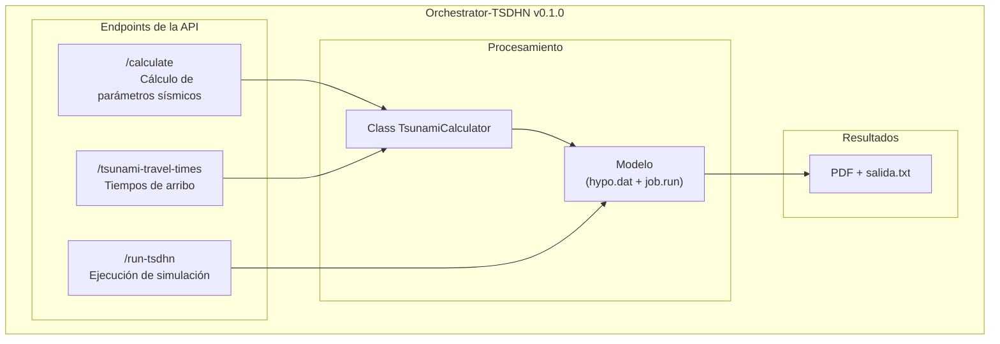

# Orchestrator-TSDHN

El Orchestrator-TSDHN es una herramienta para la estimación de parámetros de tsunamis de origen lejano mediante simulaciones numéricas. Combina el **modelo TSDHN escrito en Fortran** (ubicado en la carpeta [`/model`](/model/)) con una **API escrita en Python** ([`/orchestrator`](/orchestrator/)) que procesa datos sísmicos iniciales, como ubicación y magnitud de terremotos, para calcular variables como: dimensiones de ruptura sísmica, momento sísmico y desplazamiento de la corteza. Estas variables son utilizadas finalmente en la simulación principal, cuyo resultado incluye un informe en formato PDF con mapas de propagación, gráficos de mareógrafos y datos técnicos, además de un archivo de texto con tiempos de arribo a estaciones costeras.

> [!IMPORTANT]
> La lógica de los cálculos numéricos reside en este repositorio, mientras que la [interfaz web](https://github.com/totallynotdavid/picv-2025-web) (que gestiona solicitudes y entrega el informe al usuario final) opera en un entorno separado.

A continuación, se muestra un diagrama que ilustra el flujo general del Orchestrator-TSDHN:



## Instalación

> [!WARNING]
> Este proyecto requiere un entorno Linux (recomendamos **Ubuntu 20.04**). Para usuarios de Windows, es necesario configurar Windows Subsystem for Linux (WSL 2.0 o superior). Consulte la [<kbd>guía oficial de Microsoft</kbd>](https://learn.microsoft.com/es-es/windows/wsl/install) para la instalación de WSL.

**Prerrequisitos:**

Antes de comenzar con la instalación de las dependencias, es importante actualizar los paquetes del sistema:

```bash
sudo apt update -y && sudo apt upgrade -y
```

1. **Python** (con [pyenv](https://github.com/pyenv/pyenv)): Usamos pyenv porque nos permite instalar y usar diferentes versiones de Python a la vez.

   ```bash
   curl -fsSL https://pyenv.run | bash
   ```

   **Si estás usando WSL**, ejecuta lo siguiente [[1](https://stackoverflow.com/a/76483889)]:

   ```bash
   echo '
   export PYENV_ROOT="$HOME/.pyenv"
   export PATH="$PYENV_ROOT/bin:$PATH"
   eval "$(pyenv init -)"' >> ~/.bashrc
   ```

   **Si estás usando Linux de forma nativa**, ejecuta lo siguiente [[2](https://github.com/pyenv/pyenv?tab=readme-ov-file#bash)]:

   ```bash
   echo 'export PYENV_ROOT="$HOME/.pyenv"' >> ~/.bashrc
   echo '[[ -d $PYENV_ROOT/bin ]] && export PATH="$PYENV_ROOT/bin:$PATH"' >> ~/.bashrc
   echo 'eval "$(pyenv init - bash)"' >> ~/.bashrc
   ```

   En cualquiera de los dos casos, aplica los cambios:

   ```bash
   source ~/.bashrc
   ```

   pyenv compila Python desde el código fuente durante la instalación. Para que esto funcione, primero debes instalar las dependencias de compilación [[3](https://stackoverflow.com/a/74314165)] [[4](https://github.com/pyenv/pyenv/wiki#suggested-build-environment)]:

   ```bash
   sudo apt-get install build-essential zlib1g-dev libffi-dev libssl-dev libbz2-dev libreadline-dev libsqlite3-dev liblzma-dev libncurses-dev tk-dev
   ```

   Luego podrás instalar y usar Python:

   ```bash
   pyenv install 3.12
   pyenv global 3.12
   ```

   Si prefieres utilizar la versión de Python del sistema, solo necesitas instalar pip3:
   ```bash
   sudo apt install -y python3-pip
   ```

   En ambos casos, verifica la instalación:

   ```bash
   python3 -V
   pip3 -V
   ```

2. **Poetry** nos ayuda a gestionar nuestras dependencias de forma consistente entre dispositivos. Se encarga de instalar y mantener las librerías que usamos.

   ```bash
   curl -sSL https://install.python-poetry.org | python3 -
   echo 'export PATH="$HOME/.local/bin:$PATH"' >> ~/.bashrc
   source ~/.bashrc
   ```

   Verifica la instalación:

   ```bash
   poetry --version
   ```

3. **TTT SDK** (Tsunami Travel Time) es una herramienta para el cálculo y visualización del tiempo de viaje de tsunamis:

   Necesitas git-lfs para clonar los archivos de datos grandes del repositorio:

   ```bash
   sudo apt install -y git-lfs
   ```

   Para instalar TTTAPI:

   ```bash
   git clone https://gitlab.com/totallynotdavid/tttapi/
   cd tttapi
   make config
   make compile
   sudo make install
   sudo make datadir
   sudo make docs
   make test
   make clean
   ```

> [!NOTE]
> Usamos GitLab para alojar TTTAPI porque permite usar git-lfs de forma gratuita para archivos grandes. Esta versión es una copia del código original, lo que nos ayuda a no sobrecargar los servidores de los autores cuando ejecutamos nuestras pruebas automáticas.

4. **TeXLive** es necesario para la generación de los informes en formato PDF.

   ```bash
   cd /tmp
   wget https://mirror.ctan.org/systems/texlive/tlnet/install-tl-unx.tar.gz
   zcat < install-tl-unx.tar.gz | tar xf -
   cd install-tl-2*
   ```

   Creamos un perfil de instalación básico:

   ```bash
   cat > texlive.profile << EOF
   selected_scheme scheme-basic
   tlpdbopt_autobackup 0
   tlpdbopt_install_docfiles 0
   tlpdbopt_install_srcfiles 0
   EOF
   ```

   La instalación se realiza en el directorio del usuario para evitar problemas de permisos y evitar el [modo usuario](https://www.tug.org/texlive/doc/tlmgr.html#USER-MODE) de TeXLive (no recomendado) [[5](https://tex.stackexchange.com/a/676880)]:

   ```bash
   perl ./install-tl --profile=texlive.profile \
                     --texdir "$HOME/texlive" \
                     --texuserdir "$HOME/.texlive" \
                     --no-interaction
   ```

   Configuración del PATH:

   ```bash
   echo -e '\nexport PATH="$HOME/texlive/bin/x86_64-linux:$PATH"' >> ~/.bashrc
   source ~/.bashrc
   ```

   Instalación de paquetes LaTeX necesarios:

   ```bash
   tlmgr update --self
   tlmgr install babel-spanish hyphen-spanish booktabs
   ```

5. Dependencias adicionales: `cmake` (ttt_client) `gfortran 11.4.0`, `redis-server`, `gmt`, `ps2eps`

   ```bash
   sudo apt install -y cmake gfortran redis-server gmt gmt-dcw gmt-gshhg ps2eps
   ```

   Configura Redis para ser gestionado por systemd:

   ```bash
   sudo sed -i 's/^# \?supervised \(no\|auto\)/supervised systemd/' /etc/redis/redis.conf
   sudo systemctl restart redis-server
   ```

6. Si necesitas ejecutar la interfaz gráfica original ([<kbd>tsunami.m</kbd>](model/tsunami.m)), puedes instalar [MATLAB R2014](https://drive.google.com/file/d/1VhLnwXX78Y7O8huwlRuE-shOW2LKlVpd/view?usp=drive_link).

**Pasos de instalación:**

1. Clona el repositorio:

   ```bash
   git clone https://github.com/totallynotdavid/picv-2025
   cd picv-2025
   ```

2. Instala las dependencias con Poetry:

   ```bash
   poetry install
   poetry self add 'poethepoet[poetry_plugin]'
   eval $(poetry env activate)
   ```

3. Verifica la instalación:

   ```bash
   poetry run pytest
   ```

4. Inicia la API:

   ```bash
   poetry run start
   ```

> [!NOTE]
> La API estará disponible en `http://localhost:8000`

   En un terminal diferente, ejecuta el siguiente comando para iniciar el servidor de Redis:

   ```bash
   eval $(poetry env activate)
   rq worker tsdhn_queue
   ```

   Asegúrate de ejecutar `rq worker tsdhn_queue` dentro del entorno de Poetry para garantizar el acceso a todas las dependencias necesarias.

## Estructura del proyecto

El repositorio se organiza en dos componentes principales:

```txt
picv-2025/
├── orchestrator/
│   ├── core/
│   │   ├── calculator.py         # Class TsunamiCalculator y la lógica central de los cálculos.
│   │   └── config.py             # Define constantes globales y la configuración del logging.
│   ├── main.py                   # Punto de entrada de la API y definición de los endpoints.
│   ├── models/
│   │   └── schemas.py            # Schema para la validación y transformación de los datos.
│   └── utils/
│       └── geo.py                # Funciones para cálculos geográficos (distancias, formatos, etc.).
└── model/
    ├── pacifico.mat              # Datos de batimetría del océano Pacífico.
    ├── maper1.mat                # Datos de puntos costeros.
    ├── mecfoc.dat                # Base de datos de mecanismos focales históricos.
    ├── puertos.txt               # Lista de puertos utilizados en el cálculo de tiempos de arribo.
    ├── job.run                   # Script C Shell para ejecutar la simulación.
    ├── reporte.pdf               # Reporte generado con el mapa de tiempos y mareogramas.
    └── salida.txt                # Archivo de salida con datos del epicentro y tiempos de arribo.
```

## Flujo de procesamiento

> [!WARNING]
> El modelo solo procesa magnitudes entre Mw 6.5 y Mw 9.5. Valores fuera de este rango resultarán en un error.

El proceso inicia cuando el usuario envía datos sísmicos desde la [interfaz web](https://github.com/totallynotdavid/picv-2025-web). La API gestiona los siguientes endpoints:

1. [`/calculate`](orchestrator/main.py?plain=1#L27) recibe los valores para la magnitud (Mw), profundidad (h) y coordenadas del epicentro. Luego, calcula la geometría de la ruptura, el momento sísmico y evalúa el riesgo de tsunami. Genera el archivo [`hypo.dat`](model/hypo.dat) que se usará en la simulación.

   Los siguientes campos deben enviarse en el cuerpo de la solicitud en formato JSON:

   | Parámetro | Descripción                | Unidad         |
   | --------- | -------------------------- | -------------- |
   | `Mw`      | Magnitud momento sísmico   | Adimensional   |
   | `h`       | Profundidad del hipocentro | km             |
   | `lat0`    | Latitud del epicentro      | grados         |
   | `lon0`    | Longitud del epicentro     | grados         |
   | `dia`     | Día del mes del evento     | string         |
   | `hhmm`    | Hora y minutos del evento  | formato `HHMM` |

   Ten en cuenta que los modelos Pydantic (definidos en [`schemas.py`](orchestrator/models/schemas.py)) se encargan de validar y, en algunos casos, transformar estos parámetros para asegurar que el formato sea el correcto.

   Un ejemplo de solicitud (`POST`):

   ```json
   {
     "Mw": 7.5,
     "h": 10.0,
     "lat0": -20.5,
     "lon0": -70.5,
     "dia": "15",
     "hhmm": "1430"
   }
   ```

   Respuesta esperada:

   ```json
   {
     "length": 120.5,
     "width": 80.3,
     "dislocation": 2.5,
     "seismic_moment": 3.2e20,
     "tsunami_warning": "Alerta de tsunami para costas cercanas",
     "distance_to_coast": 45.2,
     "azimuth": 18.5,
     "dip": 30.0,
     "epicenter_location": "mar"
   }
   ```

2. [`/tsunami-travel-times`](orchestrator/main.py?plain=1#L45) utiliza los mismos datos de entrada y realiza una serie de integraciones vectorizadas para calcular los tiempos de arribo a puertos predefinidos ([`puertos.txt`](/model/puertos.txt)). La respuesta es un objeto JSON que incluye tanto los tiempos de arribo como las distancias a cada estación.
3. [`/run-tsdhn`](orchestrator/main.py?plain=1#L61) llama al script [`job.run`](model/job.run), que procesa [`hypo.dat`](model/hypo.dat) y genera resultados en ~12 minutos (en un procesador de 8 núcleos). Produce:

   - [`salida.txt`](model/salida.txt): Tiempos de arribo brutos.
   - [`reporte.pdf`](model/reporte.pdf): Mapas de altura de olas, mareógrafos y parámetros técnicos.

> [!WARNING]
> Los endpoints deben invocarse en orden estricto: `/calculate` :arrow_right: `/tsunami-travel-times` :arrow_right: `/run-tsdhn`, ya que cada uno depende del resultado del anterior.

## Notas adicionales

- La API guarda automáticamente algunos eventos en `tsunami_api.log`. Puedes configurar el logger en [`config.py`](/orchestrator/core/config.py) si deseas. El archivo de logs se crea cuando inicias la API.
- Si estás haciendo pruebas y quieres ver los logs en tu terminal mientras usas `pytest`, solo necesitas cambiar una línea en [`pyproject.toml`](pyproject.toml):
  ```toml
  [tool.pytest.ini_options]
  log_cli = true
  ```
  Te recomiendo usar `logger.debug()` en vez de `print()` o sino pytest lo ignorará.
- Cuando termines de hacer cambios en el código, y antes de hacer commit, ejecuta:
  ```bash
  poetry run pytest
  poetry poe format
  ```
  para formatear el código y asegurarte de todo sigue funcionando correctamente.
