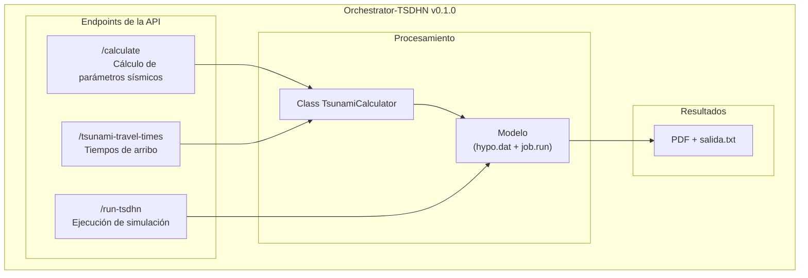

# Orchestrator-TSDHN

El Orchestrator-TSDHN es una herramienta para la estimación de parámetros de tsunamis de origen lejano mediante simulaciones numéricas. Combina el **modelo TSDHN escrito en Fortran** (ubicado en la carpeta [`/model`](/model/)) con una **API escrita en Python** ([`/orchestrator`](/orchestrator/)) que procesa datos sísmicos iniciales, como ubicación y magnitud de terremotos, para calcular variables como: dimensiones de ruptura sísmica, momento sísmico y desplazamiento de la corteza. Estas variables son utilizadas finalmente en la simulación principal, cuyo resultado incluye un informe en formato PDF con mapas de propagación, gráficos de mareógrafos y datos técnicos, además de un archivo de texto con tiempos de arribo a estaciones costeras.

> [!IMPORTANT]
> La lógica de los cálculos numéricos reside en este repositorio, mientras que la [interfaz web](https://github.com/totallynotdavid/picv-2025-web) (que gestiona solicitudes y entrega el informe al usuario final) opera en un entorno separado.

A continuación, se muestra un diagrama que ilustra el flujo general del Orchestrator-TSDHN:



## Instalación

> [!WARNING]
> El proyecto ha sido desarrollado para ejecutarse en entornos Linux (recomendamos utilizar **Ubuntu 20.04**). Para usuarios de Windows, es necesario configurar **Windows Subsystem for Linux (WSL versión 2.0 o superior)**. Puedes seguir la guía oficial de Microsoft para instalar WSL: [<kbd>Instalación de WSL</kbd>](https://learn.microsoft.com/es-es/windows/wsl/install).

**Prerrequisitos:**

1. Python 3.10.0
   ```bash
   sudo apt update -y && sudo apt upgrade -y
   python3 --version
   sudo apt install -y python3-pip
   ```
2. Poetry 2.0.1 (utilizamos Poetry para manejar nuestras dependencias)

   ```bash
   curl -sSL https://install.python-poetry.org | python3 -
   echo 'export PATH="$HOME/.local/bin:$PATH"' >> ~/.bashrc
   source ~/.bashrc
   poetry --version
   ```

3. Dependencias adicionales: `gfortran 11.4.0`, `csh`

   ```bash
   sudo apt install -y gfortran csh
   gfortran --version
   ```

4. Opcional: [MATLAB R2014](https://drive.google.com/file/d/1VhLnwXX78Y7O8huwlRuE-shOW2LKlVpd/view?usp=drive_link) (si piensas ejecutar la interfaz gráfica original: [<kbd>tsunami.m</kbd>](model/tsunami.m))

En cuanto al hardware, se recomienda tener al menos 8 GB de RAM, un CPU con 4 núcleos físicos y 5 GB de espacio libre en disco.

**Pasos de instalación:**

1. Clonar el repositorio:

   ```bash
   git clone https://github.com/totallynotdavid/picv-2025
   cd picv-2025
   ```

2. Instalar dependencias con Poetry:

   ```bash
   poetry install
   poetry self add 'poethepoet[poetry_plugin]'
   eval $(poetry env activate)
   ```

3. Verificar la instalación ejecutando:

   ```bash
   poetry run pytest
   ```

## Estructura del proyecto

El repositorio se organiza en dos componentes principales:

```txt
picv-2025/
├── orchestrator/
│   ├── core/
│   │   ├── calculator.py         # Class TsunamiCalculator y la lógica central de los cálculos.
│   │   └── config.py             # Define constantes globales y la configuración del logging.
│   ├── main.py                   # Punto de entrada de la API y definición de los endpoints.
│   ├── models/
│   │   └── schemas.py            # Schema para la validación y transformación de los datos.
│   └── utils/
│       └── geo.py                # Funciones para cálculos geográficos (distancias, formatos, etc.).
└── model/
    ├── pacifico.mat              # Datos de batimetría del océano Pacífico.
    ├── maper1.mat                # Datos de puntos costeros.
    ├── mecfoc.dat                # Base de datos de mecanismos focales históricos.
    ├── puertos.txt               # Lista de puertos utilizados en el cálculo de tiempos de arribo.
    ├── job.run                   # Script C Shell para ejecutar la simulación.
    ├── reporte.pdf               # Reporte generado con el mapa de tiempos y mareogramas.
    └── salida.txt                # Archivo de salida con datos del epicentro y tiempos de arribo.
```

## Flujo de procesamiento

> [!WARNING]
> El modelo solo procesa magnitudes entre Mw 6.5 y Mw 9.5. Valores fuera de este rango resultarán en un error.

El proceso inicia cuando el usuario envía datos sísmicos desde la [interfaz web](https://github.com/totallynotdavid/picv-2025-web). La API gestiona los siguientes endpoints:

1. [`/calculate`](orchestrator/main.py?plain=1#L25) recibe los valores para la magnitud (Mw), profundidad (h) y coordenadas del epicentro. Luego, calcula la geometría de la ruptura, el momento sísmico y evalúa el riesgo de tsunami. Genera el archivo [hypo.dat](model/hypo.dat) que se usará en la simulación.

   Los siguientes campos deben enviarse en el cuerpo de la solicitud en formato JSON:

   | Parámetro | Descripción                | Unidad         |
   | --------- | -------------------------- | -------------- |
   | `Mw`      | Magnitud momento sísmico   | Adimensional   |
   | `h`       | Profundidad del hipocentro | km             |
   | `lat0`    | Latitud del epicentro      | grados         |
   | `lon0`    | Longitud del epicentro     | grados         |
   | `dia`     | Día del mes del evento     | string         |
   | `hhmm`    | Hora y minutos del evento  | formato `HHMM` |

   Ten en cuenta que los modelos Pydantic (definidos en [schemas.py](orchestrator/models/schemas.py)) se encargan de validar y, en algunos casos, transformar estos parámetros para asegurar que el formato sea el correcto.

   Un ejemplo de solicitud (`POST`):

   ```json
   {
     "Mw": 7.5,
     "h": 10.0,
     "lat0": -20.5,
     "lon0": -70.5,
     "dia": "15",
     "hhmm": "1430"
   }
   ```

   Respuesta esperada:

   ```json
   {
     "length": 120.5,
     "width": 80.3,
     "dislocation": 2.5,
     "seismic_moment": 3.2e20,
     "tsunami_warning": "Alerta de tsunami para costas cercanas",
     "distance_to_coast": 45.2,
     "azimuth": 18.5,
     "dip": 30.0,
     "epicenter_location": "mar"
   }
   ```

2. [`/tsunami-travel-times`](orchestrator/main.py?plain=1#L43) utiliza los mismos datos de entrada y realiza una serie de integraciones vectorizadas para calcular los tiempos de arribo a puertos predefinidos ([`puertos.txt`](/model/puertos.txt)). La respuesta es un objeto JSON que incluye tanto los tiempos de arribo como las distancias a cada estación.
3. [`/run-tsdhn`](orchestrator/main.py?plain=1#L59) llama al script [job.run](model/job.run), que procesa [hypo.dat](model/hypo.dat) y genera resultados en ~12 minutos (en un procesador de 8 núcleos). Produce:

   - [`salida.txt`](model/salida.txt): Tiempos de arribo brutos.
   - [`reporte.pdf`](model/reporte.pdf): Mapas de altura de olas, mareógrafos y parámetros técnicos.

> [!WARNING]
> Los endpoints deben invocarse en orden estricto: `/calculate` :arrow_right: `/tsunami-travel-times` :arrow_right: `/run-tsdhn`, ya que cada uno depende del resultado del anterior.

## Notas adicionales

- La API guarda automáticamente algunos eventos en `tsunami_api.log`. Puedes configurar el logger en [`config.py`](/orchestrator/core/config.py) si deseas. El archivo de logs se crea cuando inicias la API.
- Si estás haciendo pruebas y quieres ver los logs en tu terminal mientras usas `pytest`, solo necesitas cambiar una línea en [`pyproject.toml`](pyproject.toml):
  ```toml
  [tool.pytest.ini_options]
  log_cli = true
  ```
  Te recomiendo usar `logger.debug()` en vez de `print()` o sino pytest lo ignorará.
- Cuando termines de hacer cambios en el código, y antes de hacer commit, ejecuta:
  ```bash
  poetry run pytest
  poetry poe format
  ```
  para formatear el código y asegurarte de todo sigue funcionando correctamente.
